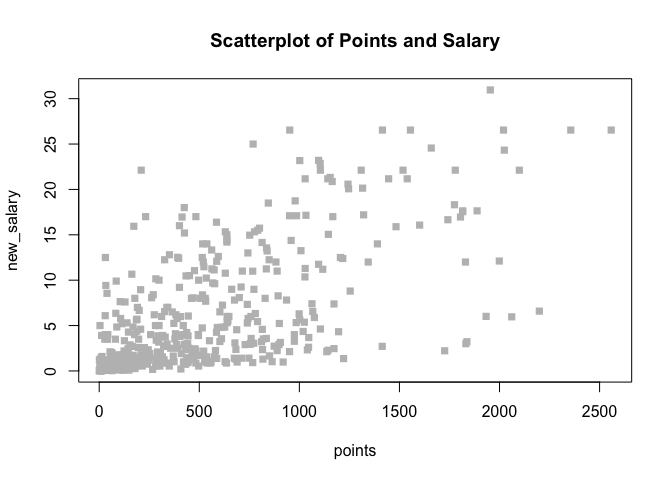
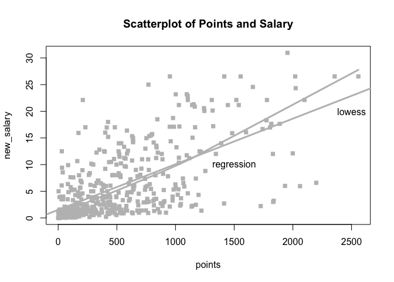

hw01
================
Daniel Kang
9/24/2017

``` r
load("data/nba2017-salary-points.RData")
ls()
```

    ## [1] "experience" "player"     "points"     "points1"    "points2"   
    ## [6] "points3"    "position"   "salary"     "team"

``` r
new_salary <- round(salary/1000000,2)
i_experience <- as.integer(replace(experience, experience == "R", 0))
center <- 'C'
small_fwd <- 'SF'
power_fwd <- 'PF'
shoot_guard <- 'SG'
point_guard <- 'PG'
x <- points
y <- new_salary
```

``` r
#2
plot(points, new_salary, main = "Scatterplot of Points and Salary", xlab = 'points', ylab = 'new_salary', pch = 15, col = 80, cex = 1)
```



``` r
#3 Correlation between Points and Salary
n <- length(salary)
mean_ofx <- 1/n * sum(points)
mean_ofy <- 1/n * sum(new_salary)
var_ofx <- 1/(n-1) * sum((points - mean_ofx)^2)
var_ofy <- 1/(n-1) * sum((new_salary - mean_ofy)^2)
sd_ofx <- sqrt(var_ofx)
sd_ofy <- sqrt(var_ofy)
cov_ofxy <- 1/(n-1) * sum((points-mean_ofx)*(new_salary-mean_ofy))
cor_ofxy <- cov_ofxy/(sd_ofx * sd_ofy)
```

``` r
#4 Simple Linear Regresaion
b1 <- sd_ofy/sd_ofx * cor_ofxy
b0 <- mean_ofy - b1 * mean_ofx
y_hat <- b0 + b1 * x
```

``` r
#5 Plotting the regression line
x <- points
b1 <- cor_ofxy * sd_ofy/sd_ofx
b0 <- mean_ofy - b1*mean_ofx
y_hat <- b0 + b1 * x
plot(points, new_salary, main = "Scatterplot of Points and Salary", xlab = 'points', ylab = 'new_salary', pch = 15, col =80 , cex = 1)
abline(lm(y_hat~points), lwd = 3, col = 80)
lines(lowess(y ~ x, f = 9), col = 80, lwd = 3)
text(x = 2500, y = 50, labels = "regression")
text(x = 2500, y = 50, labels = "lowess")
```



``` r
#6
x <- points
y <- new_salary
#Residual Sum 
e_ii <- y - y_hat
RSS <- sum((e_ii)^2)
TSS <- ((var_ofy - mean_ofy)^2)
RSQ <- 1- (RSS/TSS)
summary(e_ii)
```

    ##    Min. 1st Qu.  Median    Mean 3rd Qu.    Max. 
    ## -14.187  -2.792  -1.095   0.000   2.556  18.814

``` r
RSS
```

    ## [1] 11300.45

``` r
TSS
```

    ## [1] 1369.633

``` r
RSQ
```

    ## [1] -7.25071

``` r
#7
plot(points, new_salary, main = "Scartterpolt with Lowess Smooth", xlab = "Years of Experience", lines(lowess(points,new_salary ), col = 10))
```


What things were hard, even though you saw them in class?
=========================================================

start to understand coding and using terminal is hard.

What was easy(-ish) even though we haven’t done it in class?
============================================================

nothing is easy to me because this is my first coding experience.

If this was the first time you were using git, how do you feel about it?
========================================================================

its a pretty good website to record my stuff.

If this was the first time using GitHub, how do you feel about it?
==================================================================

its good!

Did you need help to complete the assignment? If so, what kind of help? Who helpedyou?
======================================================================================

Yes, I always need help during doing the assignment.

How much time did it take to complete this HW?
==============================================

about 4 hours

What was the most time consuming part?
======================================

assignment and importing the data set

Was there anything that you did not understand? or fully grasped?
=================================================================

I thinl I am bad at debugging, like I dont understand the message when the error poped out

Was there anything frustrating in particular?
=============================================

no

Was there anything exciting? Something that you feel proud of?
==============================================================

yes, I can finally make a graph from a data set!!
