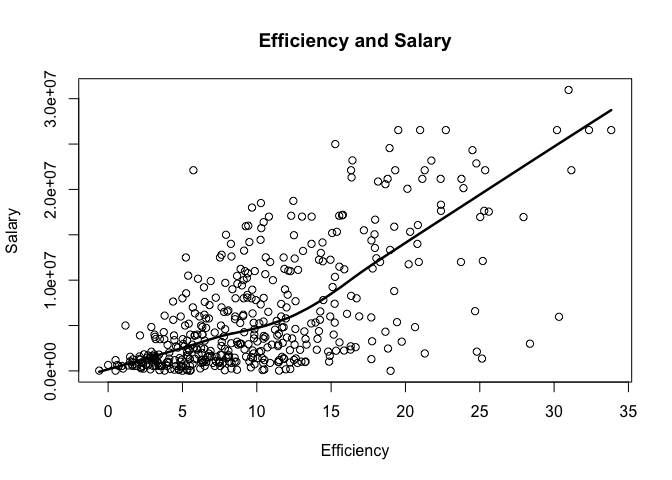

hw02-Daniel-Kang.Rmd
================
Daniel Kang
9/29/2017

``` r
# download csv file to your working directory
# (do NOT include this code in your Rmd)
github <- "https://github.com/ucb-stat133/stat133-fall-2017/raw/master/"
file <- "data/nba2017-player-statistics.csv"
csv <- paste0(github, file)
download.file(url = csv, destfile = 'nba2017-player-statistics.csv')
getwd()
```

    ## [1] "/Users/Danielisgood/stat133-hws-fall17/hw02"

``` r
library(dplyr)
```

    ## Warning: package 'dplyr' was built under R version 3.4.2

    ## 
    ## Attaching package: 'dplyr'

    ## The following objects are masked from 'package:stats':
    ## 
    ##     filter, lag

    ## The following objects are masked from 'package:base':
    ## 
    ##     intersect, setdiff, setequal, union

basis\#2
========

``` r
#the columns Player, Team, and Experience have to be declared as type character.
getwd()
```

    ## [1] "/Users/Danielisgood/stat133-hws-fall17/hw02"

``` r
cat1 <- read.csv("nba2017-player-statistics.csv", TRUE, ",")
cat1s <- read.csv("nba2017-player-statistics.csv", TRUE, colClasses = c("character","character","factor", "character", "double", "integer","integer","integer","integer","integer","integer","integer","integer","integer","integer","integer","integer","integer","integer","integer","integer","integer","integer","integer" ))
str(cat1)
```

    ## 'data.frame':    441 obs. of  24 variables:
    ##  $ Player      : Factor w/ 441 levels "A.J. Hammons",..: 5 16 30 103 146 161 169 181 189 213 ...
    ##  $ Team        : Factor w/ 30 levels "ATL","BOS","BRK",..: 2 2 2 2 2 2 2 2 2 2 ...
    ##  $ Position    : Factor w/ 5 levels "C","PF","PG",..: 1 2 5 3 4 3 4 5 4 2 ...
    ##  $ Experience  : Factor w/ 19 levels "1","10","11",..: 18 3 15 19 18 14 13 11 19 15 ...
    ##  $ Salary      : num  26540100 12000000 8269663 1450000 1410598 ...
    ##  $ Rank        : int  4 6 5 15 11 1 3 13 8 10 ...
    ##  $ Age         : int  30 29 26 22 31 27 26 21 20 29 ...
    ##  $ GP          : int  68 80 55 5 47 76 72 29 78 78 ...
    ##  $ GS          : int  68 77 55 0 0 76 72 0 20 6 ...
    ##  $ MIN         : int  2193 1608 1835 17 538 2569 2335 220 1341 1232 ...
    ##  $ FGM         : int  379 213 359 3 95 682 333 25 192 114 ...
    ##  $ FGA         : int  801 370 775 4 232 1473 720 58 423 262 ...
    ##  $ Points3     : int  86 27 108 1 39 245 157 12 46 45 ...
    ##  $ Points3_atts: int  242 66 277 1 111 646 394 35 135 130 ...
    ##  $ Points2     : int  293 186 251 2 56 437 176 13 146 69 ...
    ##  $ Points2_atts: int  559 304 498 3 121 827 326 23 288 132 ...
    ##  $ FTM         : int  108 67 68 3 33 590 176 6 85 26 ...
    ##  $ FTA         : int  135 100 93 6 41 649 217 9 124 37 ...
    ##  $ OREB        : int  95 117 65 2 17 43 48 6 45 60 ...
    ##  $ DREB        : int  369 248 269 2 68 162 367 20 175 213 ...
    ##  $ AST         : int  337 140 121 3 33 449 155 4 64 71 ...
    ##  $ STL         : int  52 52 68 0 9 70 72 10 35 26 ...
    ##  $ BLK         : int  87 62 11 0 7 13 23 2 18 17 ...
    ##  $ TO          : int  116 77 88 0 25 210 79 4 68 39 ...

readr\#2
========

``` r
library(readr)
cat2 <- read_csv("data/nba2017-player-statistics.csv")
```

    ## Parsed with column specification:
    ## cols(
    ##   .default = col_integer(),
    ##   Player = col_character(),
    ##   Team = col_character(),
    ##   Position = col_character(),
    ##   Experience = col_character(),
    ##   Salary = col_double()
    ## )

    ## See spec(...) for full column specifications.

``` r
str(cat2)
```

    ## Classes 'tbl_df', 'tbl' and 'data.frame':    441 obs. of  24 variables:
    ##  $ Player      : chr  "Al Horford" "Amir Johnson" "Avery Bradley" "Demetrius Jackson" ...
    ##  $ Team        : chr  "BOS" "BOS" "BOS" "BOS" ...
    ##  $ Position    : chr  "C" "PF" "SG" "PG" ...
    ##  $ Experience  : chr  "9" "11" "6" "R" ...
    ##  $ Salary      : num  26540100 12000000 8269663 1450000 1410598 ...
    ##  $ Rank        : int  4 6 5 15 11 1 3 13 8 10 ...
    ##  $ Age         : int  30 29 26 22 31 27 26 21 20 29 ...
    ##  $ GP          : int  68 80 55 5 47 76 72 29 78 78 ...
    ##  $ GS          : int  68 77 55 0 0 76 72 0 20 6 ...
    ##  $ MIN         : int  2193 1608 1835 17 538 2569 2335 220 1341 1232 ...
    ##  $ FGM         : int  379 213 359 3 95 682 333 25 192 114 ...
    ##  $ FGA         : int  801 370 775 4 232 1473 720 58 423 262 ...
    ##  $ Points3     : int  86 27 108 1 39 245 157 12 46 45 ...
    ##  $ Points3_atts: int  242 66 277 1 111 646 394 35 135 130 ...
    ##  $ Points2     : int  293 186 251 2 56 437 176 13 146 69 ...
    ##  $ Points2_atts: int  559 304 498 3 121 827 326 23 288 132 ...
    ##  $ FTM         : int  108 67 68 3 33 590 176 6 85 26 ...
    ##  $ FTA         : int  135 100 93 6 41 649 217 9 124 37 ...
    ##  $ OREB        : int  95 117 65 2 17 43 48 6 45 60 ...
    ##  $ DREB        : int  369 248 269 2 68 162 367 20 175 213 ...
    ##  $ AST         : int  337 140 121 3 33 449 155 4 64 71 ...
    ##  $ STL         : int  52 52 68 0 9 70 72 10 35 26 ...
    ##  $ BLK         : int  87 62 11 0 7 13 23 2 18 17 ...
    ##  $ TO          : int  116 77 88 0 25 210 79 4 68 39 ...
    ##  - attr(*, "spec")=List of 2
    ##   ..$ cols   :List of 24
    ##   .. ..$ Player      : list()
    ##   .. .. ..- attr(*, "class")= chr  "collector_character" "collector"
    ##   .. ..$ Team        : list()
    ##   .. .. ..- attr(*, "class")= chr  "collector_character" "collector"
    ##   .. ..$ Position    : list()
    ##   .. .. ..- attr(*, "class")= chr  "collector_character" "collector"
    ##   .. ..$ Experience  : list()
    ##   .. .. ..- attr(*, "class")= chr  "collector_character" "collector"
    ##   .. ..$ Salary      : list()
    ##   .. .. ..- attr(*, "class")= chr  "collector_double" "collector"
    ##   .. ..$ Rank        : list()
    ##   .. .. ..- attr(*, "class")= chr  "collector_integer" "collector"
    ##   .. ..$ Age         : list()
    ##   .. .. ..- attr(*, "class")= chr  "collector_integer" "collector"
    ##   .. ..$ GP          : list()
    ##   .. .. ..- attr(*, "class")= chr  "collector_integer" "collector"
    ##   .. ..$ GS          : list()
    ##   .. .. ..- attr(*, "class")= chr  "collector_integer" "collector"
    ##   .. ..$ MIN         : list()
    ##   .. .. ..- attr(*, "class")= chr  "collector_integer" "collector"
    ##   .. ..$ FGM         : list()
    ##   .. .. ..- attr(*, "class")= chr  "collector_integer" "collector"
    ##   .. ..$ FGA         : list()
    ##   .. .. ..- attr(*, "class")= chr  "collector_integer" "collector"
    ##   .. ..$ Points3     : list()
    ##   .. .. ..- attr(*, "class")= chr  "collector_integer" "collector"
    ##   .. ..$ Points3_atts: list()
    ##   .. .. ..- attr(*, "class")= chr  "collector_integer" "collector"
    ##   .. ..$ Points2     : list()
    ##   .. .. ..- attr(*, "class")= chr  "collector_integer" "collector"
    ##   .. ..$ Points2_atts: list()
    ##   .. .. ..- attr(*, "class")= chr  "collector_integer" "collector"
    ##   .. ..$ FTM         : list()
    ##   .. .. ..- attr(*, "class")= chr  "collector_integer" "collector"
    ##   .. ..$ FTA         : list()
    ##   .. .. ..- attr(*, "class")= chr  "collector_integer" "collector"
    ##   .. ..$ OREB        : list()
    ##   .. .. ..- attr(*, "class")= chr  "collector_integer" "collector"
    ##   .. ..$ DREB        : list()
    ##   .. .. ..- attr(*, "class")= chr  "collector_integer" "collector"
    ##   .. ..$ AST         : list()
    ##   .. .. ..- attr(*, "class")= chr  "collector_integer" "collector"
    ##   .. ..$ STL         : list()
    ##   .. .. ..- attr(*, "class")= chr  "collector_integer" "collector"
    ##   .. ..$ BLK         : list()
    ##   .. .. ..- attr(*, "class")= chr  "collector_integer" "collector"
    ##   .. ..$ TO          : list()
    ##   .. .. ..- attr(*, "class")= chr  "collector_integer" "collector"
    ##   ..$ default: list()
    ##   .. ..- attr(*, "class")= chr  "collector_guess" "collector"
    ##   ..- attr(*, "class")= chr "col_spec"

``` r
cat2 <- read_csv("nba2017-player-statistics.csv", 
                 col_types = list(Player = col_character(), 
                 Team = col_character(), 
                 Position = col_factor(c("C", "SF", "PF", "PG","SG")),
                 Experience = col_character(), 
                 Salary = col_double())
                 
)
str(cat1)
```

    ## 'data.frame':    441 obs. of  24 variables:
    ##  $ Player      : Factor w/ 441 levels "A.J. Hammons",..: 5 16 30 103 146 161 169 181 189 213 ...
    ##  $ Team        : Factor w/ 30 levels "ATL","BOS","BRK",..: 2 2 2 2 2 2 2 2 2 2 ...
    ##  $ Position    : Factor w/ 5 levels "C","PF","PG",..: 1 2 5 3 4 3 4 5 4 2 ...
    ##  $ Experience  : Factor w/ 19 levels "1","10","11",..: 18 3 15 19 18 14 13 11 19 15 ...
    ##  $ Salary      : num  26540100 12000000 8269663 1450000 1410598 ...
    ##  $ Rank        : int  4 6 5 15 11 1 3 13 8 10 ...
    ##  $ Age         : int  30 29 26 22 31 27 26 21 20 29 ...
    ##  $ GP          : int  68 80 55 5 47 76 72 29 78 78 ...
    ##  $ GS          : int  68 77 55 0 0 76 72 0 20 6 ...
    ##  $ MIN         : int  2193 1608 1835 17 538 2569 2335 220 1341 1232 ...
    ##  $ FGM         : int  379 213 359 3 95 682 333 25 192 114 ...
    ##  $ FGA         : int  801 370 775 4 232 1473 720 58 423 262 ...
    ##  $ Points3     : int  86 27 108 1 39 245 157 12 46 45 ...
    ##  $ Points3_atts: int  242 66 277 1 111 646 394 35 135 130 ...
    ##  $ Points2     : int  293 186 251 2 56 437 176 13 146 69 ...
    ##  $ Points2_atts: int  559 304 498 3 121 827 326 23 288 132 ...
    ##  $ FTM         : int  108 67 68 3 33 590 176 6 85 26 ...
    ##  $ FTA         : int  135 100 93 6 41 649 217 9 124 37 ...
    ##  $ OREB        : int  95 117 65 2 17 43 48 6 45 60 ...
    ##  $ DREB        : int  369 248 269 2 68 162 367 20 175 213 ...
    ##  $ AST         : int  337 140 121 3 33 449 155 4 64 71 ...
    ##  $ STL         : int  52 52 68 0 9 70 72 10 35 26 ...
    ##  $ BLK         : int  87 62 11 0 7 13 23 2 18 17 ...
    ##  $ TO          : int  116 77 88 0 25 210 79 4 68 39 ...

3 change the values in Ecperience
=================================

``` r
cat1$Experience[cat1$Experience == 'R'] <- 0
```

    ## Warning in `[<-.factor`(`*tmp*`, cat1$Experience == "R", value =
    ## structure(c(18L, : invalid factor level, NA generated

``` r
cat1$Experience = as.integer(cat1$Experience)
```

4 Performance of players
========================

``` r
missed_fg <- cat1$FGA - cat1$FGM
missed_ft <- cat1$FTA - cat1$FTM
PTS <- cat1$Points2 * 2 + cat1$Points3*3 + cat1$FTM
AST <- cat1$AST
STL <- cat1$STL
TO <- cat1$TO
REB <- cat1$OREB+cat1$DREB
GP <- cat1$GP
BLK <- cat1$BLK
EFF <- (PTS + REB + cat1$AST + cat1$STL + cat1$BLK - missed_fg - missed_ft - cat1$TO)/GP
MPG <- cat1$MIN/cat1$GP
summary(EFF)
```

    ##    Min. 1st Qu.  Median    Mean 3rd Qu.    Max. 
    ##  -0.600   5.452   9.090  10.137  13.247  33.840

``` r
#graph
hist(EFF, breaks = 5,
     freq = TRUE,
     border = TRUE,
     xlim = c(-5,35),
     main = "Histogram of Effucuency (EFF)")
```


``` r
#Disply the player, name, team, salary and EFF value of the top 10 players by EEF in decreasing order
cat1 <- mutate(cat1,EFF)
top10EFF <- arrange(cat1, desc(EFF))
top10EFF[1:10, c("Player", "Team", "Salary", "EFF")]
```

    ##                   Player Team   Salary      EFF
    ## 1      Russell Westbrook  OKC 26540100 33.83951
    ## 2           James Harden  HOU 26540100 32.34568
    ## 3          Anthony Davis  NOP 22116750 31.16000
    ## 4           LeBron James  CLE 30963450 30.97297
    ## 5     Karl-Anthony Towns  MIN  5960160 30.32927
    ## 6           Kevin Durant  GSW 26540100 30.19355
    ## 7  Giannis Antetokounmpo  MIL  2995421 28.37500
    ## 8       DeMarcus Cousins  NOP 16957900 27.94118
    ## 9           Jimmy Butler  CHI 17552209 25.60526
    ## 10      Hassan Whiteside  MIA 22116750 25.36364

``` r
#procide the names fo the players that have a negitive EFF
nEFF <- data.frame(cat1[EFF < 0,])
nEFF
```

    ##              Player Team Position Experience Salary Rank Age GP GS MIN FGM
    ## 188 Patricio Garino  ORL       SG         NA  31969   17  23  5  0  43   0
    ##     FGA Points3 Points3_atts Points2 Points2_atts FTM FTA OREB DREB AST
    ## 188   7       0            5       0            2   0   0    1    6   0
    ##     STL BLK TO  EFF
    ## 188   0   0  3 -0.6

``` r
#Correlation
Correlation <- data.frame (
                          PTS = cor(EFF,PTS), 
                          REB = cor(EFF, REB),
                          AST = cor(EFF, AST), 
                          STL = cor(EFF, STL), 
                          BLK = cor(EFF, BLK),
                          TO = cor(EFF, (-1)* TO),
                          missed_fg = cor(EFF, (-1)*missed_fg), 
                          missed_ft = cor(EFF, (-1)*missed_ft)
                          
)
Correlation
```

    ##         PTS       REB       AST       STL       BLK         TO  missed_fg
    ## 1 0.8588644 0.7634501 0.6689232 0.6957286 0.5679571 -0.8003289 -0.7722477
    ##    missed_ft
    ## 1 -0.7271456

``` r
cat1 <- mutate(cat1,EFF)
str(cat1)
```

    ## 'data.frame':    441 obs. of  25 variables:
    ##  $ Player      : Factor w/ 441 levels "A.J. Hammons",..: 5 16 30 103 146 161 169 181 189 213 ...
    ##  $ Team        : Factor w/ 30 levels "ATL","BOS","BRK",..: 2 2 2 2 2 2 2 2 2 2 ...
    ##  $ Position    : Factor w/ 5 levels "C","PF","PG",..: 1 2 5 3 4 3 4 5 4 2 ...
    ##  $ Experience  : int  18 3 15 NA 18 14 13 11 NA 15 ...
    ##  $ Salary      : num  26540100 12000000 8269663 1450000 1410598 ...
    ##  $ Rank        : int  4 6 5 15 11 1 3 13 8 10 ...
    ##  $ Age         : int  30 29 26 22 31 27 26 21 20 29 ...
    ##  $ GP          : int  68 80 55 5 47 76 72 29 78 78 ...
    ##  $ GS          : int  68 77 55 0 0 76 72 0 20 6 ...
    ##  $ MIN         : int  2193 1608 1835 17 538 2569 2335 220 1341 1232 ...
    ##  $ FGM         : int  379 213 359 3 95 682 333 25 192 114 ...
    ##  $ FGA         : int  801 370 775 4 232 1473 720 58 423 262 ...
    ##  $ Points3     : int  86 27 108 1 39 245 157 12 46 45 ...
    ##  $ Points3_atts: int  242 66 277 1 111 646 394 35 135 130 ...
    ##  $ Points2     : int  293 186 251 2 56 437 176 13 146 69 ...
    ##  $ Points2_atts: int  559 304 498 3 121 827 326 23 288 132 ...
    ##  $ FTM         : int  108 67 68 3 33 590 176 6 85 26 ...
    ##  $ FTA         : int  135 100 93 6 41 649 217 9 124 37 ...
    ##  $ OREB        : int  95 117 65 2 17 43 48 6 45 60 ...
    ##  $ DREB        : int  369 248 269 2 68 162 367 20 175 213 ...
    ##  $ AST         : int  337 140 121 3 33 449 155 4 64 71 ...
    ##  $ STL         : int  52 52 68 0 9 70 72 10 35 26 ...
    ##  $ BLK         : int  87 62 11 0 7 13 23 2 18 17 ...
    ##  $ TO          : int  116 77 88 0 25 210 79 4 68 39 ...
    ##  $ EFF         : num  19.51 10.9 16.35 2.6 4.81 ...

``` r
#display
new_Cor <- sort(Correlation, decreasing = TRUE)
barplot(as.numeric(new_Cor), ylim = c(-1,1), main = 'Correlation between Player Stats and EFF', names.arg = variable.names(new_Cor), col = ifelse(as.numeric(new_Cor) > 0, "grey", "coral2"), border = NA)
abline(h = 0)
```

 \#5 Efficiency and Salary

``` r
#5
X = data.frame(cat1$EFF, cat1$Salary)
plot(X, main = "Efficiency and Salary", xlab = "Efficiency", ylab = "Salary")
lines(lowess(X), col = "black", lwd = 2.5)
```



``` r
cor(cat1$EFF, cat1$Salary)
```

    ## [1] 0.655624

``` r
cat1[MPG >= 20, ]
```

    ##                       Player Team Position Experience   Salary Rank Age GP
    ## 1                 Al Horford  BOS        C         18 26540100    4  30 68
    ## 2               Amir Johnson  BOS       PF          3 12000000    6  29 80
    ## 3              Avery Bradley  BOS       SG         15  8269663    5  26 55
    ## 6              Isaiah Thomas  BOS       PG         14  6587132    1  27 76
    ## 7                Jae Crowder  BOS       SF         13  6286408    3  26 72
    ## 12              Kelly Olynyk  BOS        C         12  3094014    7  25 75
    ## 13              Marcus Smart  BOS       SG         11  3578880    2  22 79
    ## 18            Deron Williams  CLE       PG          3   259626   11  32 24
    ## 20               Edy Tavares  CLE        C          1     5145   18  24  1
    ## 21             Iman Shumpert  CLE       SG         14  9700000    4  26 76
    ## 22                J.R. Smith  CLE       SG          4 12800000    8  31 41
    ## 25                Kevin Love  CLE       PF         17 21165675    5  28 60
    ## 26               Kyle Korver  CLE       SG          5  5239437    9  35 35
    ## 27              Kyrie Irving  CLE       PG         14 17638063    2  24 72
    ## 28              LeBron James  CLE       SF          5 30963450    1  32 74
    ## 29         Richard Jefferson  CLE       SF          7  2500000    6  36 79
    ## 30          Tristan Thompson  CLE        C         14 15330435    3  25 78
    ## 32               Cory Joseph  TOR       SG         14  7330000    4  25 80
    ## 34             DeMar DeRozan  TOR       SG         16 26540100    1  27 74
    ## 35           DeMarre Carroll  TOR       SF         16 14200000    5  30 72
    ## 38         Jonas Valanciunas  TOR        C         13 14382022    3  24 80
    ## 39                Kyle Lowry  TOR       PG          2 12000000    2  30 60
    ## 42               P.J. Tucker  TOR       SF         14  5300000   13  31 24
    ## 44         Patrick Patterson  TOR       PF         15  6050000    6  27 65
    ## 45               Serge Ibaka  TOR       PF         16 12250000   11  27 23
    ## 46          Bojan Bogdanovic  WAS       SF         11  3730653   10  27 26
    ## 47              Bradley Beal  WAS       SG         13 22116750    2  23 77
    ## 53                 John Wall  WAS       PG         15 16957900    1  26 78
    ## 54             Marcin Gortat  WAS        C         18 12000000    4  32 82
    ## 55           Markieff Morris  WAS       PF         14  7400000    5  27 76
    ## 56               Otto Porter  WAS       SF         12  5893981    3  23 80
    ## 61           Dennis Schroder  ATL       PG         12  2708582    1  23 79
    ## 62             Dwight Howard  ATL        C          4 23180275    3  31 74
    ## 63            Ersan Ilyasova  ATL       PF         17  8400000   12  29 26
    ## 65             Kent Bazemore  ATL       SF         13 15730338    5  27 73
    ## 70              Paul Millsap  ATL       PF          2 20072033    2  31 69
    ## 72           Thabo Sefolosha  ATL       SF          2  3850000    6  32 62
    ## 73              Tim Hardaway  ATL       SG         12  2281605    4  24 79
    ## 74     Giannis Antetokounmpo  MIL       SF         12  2995421    1  22 80
    ## 75               Greg Monroe  MIL        C         15 17100000    5  26 81
    ## 76             Jabari Parker  MIL       PF         11  5374320    6  21 51
    ## 79           Khris Middleton  MIL       SF         13 15200000   11  25 29
    ## 80           Malcolm Brogdon  MIL       SG         NA   925000    4  24 75
    ## 81       Matthew Dellavedova  MIL       PG         12  9607500    3  26 76
    ## 87                Tony Snell  MIL       SG         12  2368327    2  25 80
    ## 90                C.J. Miles  IND       SF          3  4583450    6  29 76
    ## 92               Jeff Teague  IND       PG         16  8800000    2  28 82
    ## 95          Lance Stephenson  IND       SG         15  4000000   15  26  6
    ## 97               Monta Ellis  IND       SG          3 10770000    5  31 74
    ## 98              Myles Turner  IND        C          1  2463840    3  20 81
    ## 99               Paul George  IND       SF         15 18314532    1  26 75
    ## 101           Thaddeus Young  IND       PF         18 14153652    4  28 74
    ## 107              Dwyane Wade  CHI       SG          5 23200000    4  35 60
    ## 110             Jimmy Butler  CHI       SF         14 17552209    1  27 76
    ## 113           Nikola Mirotic  CHI       PF         11  5782450    5  25 70
    ## 115              Rajon Rondo  CHI       PG          2 14000000    3  30 69
    ## 116              Robin Lopez  CHI        C         17 13219250    2  28 81
    ## 117             Dion Waiters  MIA       SG         13  2898000    8  25 46
    ## 118             Goran Dragic  MIA       PG         17 15890000    2  30 73
    ## 119         Hassan Whiteside  MIA        C         13 22116750    1  27 77
    ## 120            James Johnson  MIA       PF         16  4000000    4  29 76
    ## 122          Josh Richardson  MIA       SG          1   874636    6  23 53
    ## 123          Justise Winslow  MIA       SF          1  2593440   11  20 18
    ## 126          Rodney McGruder  MIA       SG         NA   543471    5  25 78
    ## 127            Tyler Johnson  MIA       PG         11  5628000    3  24 73
    ## 129          Wayne Ellington  MIA       SG         16  6000000    7  29 62
    ## 131           Andre Drummond  DET        C         13 22116750    4  23 81
    ## 137                Ish Smith  DET       PG         15  6000000    5  28 81
    ## 138                Jon Leuer  DET       PF         14 10991957    6  27 75
    ## 139 Kentavious Caldwell-Pope  DET       SG         12  3678319    3  23 76
    ## 140            Marcus Morris  DET       SF         14  4625000    2  27 79
    ## 143           Reggie Jackson  DET       PG         14 14956522    7  26 52
    ## 145            Tobias Harris  DET       PF         14 17200000    1  24 82
    ## 149              Cody Zeller  CHO       PF         12  5318313    7  24 62
    ## 150           Frank Kaminsky  CHO        C          1  2730000    5  23 75
    ## 153             Kemba Walker  CHO       PG         14 12000000    1  26 79
    ## 154          Marco Belinelli  CHO       SG         18  6333333    6  30 74
    ## 155          Marvin Williams  CHO       PF          3 12250000    4  30 76
    ## 156   Michael Kidd-Gilchrist  CHO       SF         13 13000000    3  23 81
    ## 158            Nicolas Batum  CHO       SG         17 20869566    2  28 77
    ## 161          Carmelo Anthony  NYK       SF          5 24559380    1  32 74
    ## 163             Courtney Lee  NYK       SG         17 11242000    2  31 77
    ## 164             Derrick Rose  NYK       PG         16 21323250    4  28 64
    ## 165              Joakim Noah  NYK        C         18 17000000   10  31 46
    ## 167       Kristaps Porzingis  NYK       PF          1  4317720    3  21 66
    ## 169             Lance Thomas  NYK       PF         14  6191000   11  28 46
    ## 176             Aaron Gordon  ORL       SF         11  4351320    2  21 80
    ## 177          Bismack Biyombo  ORL        C         14 17000000    5  24 81
    ## 181            Elfrid Payton  ORL       PG         11  2613600    1  22 82
    ## 182            Evan Fournier  ORL       SG         13 17000000    3  24 68
    ## 183               Jeff Green  ORL       PF         17 15000000    8  30 69
    ## 184              Jodie Meeks  ORL       SG         16  6540000   12  29 36
    ## 187           Nikola Vucevic  ORL        C         14 11750000    4  26 75
    ## 190            Terrence Ross  ORL       SF         13 10000000   11  25 24
    ## 191           Alex Poythress  PHI       PF         NA    31969   16  23  6
    ## 192              Dario Saric  PHI       PF         NA  2318280    3  22 81
    ## 193         Gerald Henderson  PHI       SG         16  9000000    5  29 72
    ## 194            Jahlil Okafor  PHI        C          1  4788840   10  21 50
    ## 195           Jerryd Bayless  PHI       PG         17  9424084   19  28  3
    ## 196              Joel Embiid  PHI        C         NA  4826160   11  22 31
    ## 197          Justin Anderson  PHI       SF          1  1514160   14  23 24
    ## 198             Nik Stauskas  PHI       SG         11  2993040    1  23 80
    ## 199           Richaun Holmes  PHI        C          1  1025831    8  23 57
    ## 200         Robert Covington  PHI       SF         12  1015696    4  26 67
    ## 201         Sergio Rodriguez  PHI       PG         13  8000000    6  30 68
    ## 203           T.J. McConnell  PHI       PG          1   874636    2  24 81
    ## 208              Brook Lopez  BRK        C         17 21165675    1  28 75
    ## 209             Caris LeVert  BRK       SF         NA  1562280    9  22 57
    ## 210         Isaiah Whitehead  BRK       PG         NA  1074145    5  21 73
    ## 211               Jeremy Lin  BRK       PG         15 11483254   12  28 36
    ## 212               Joe Harris  BRK       SG         11   980431   11  25 52
    ## 217  Rondae Hollis-Jefferson  BRK       SF          1  1395600    2  22 78
    ## 218          Sean Kilpatrick  BRK       SG         11   980431    4  27 70
    ## 219        Spencer Dinwiddie  BRK       PG         11   726672    7  23 59
    ## 220            Trevor Booker  BRK       PF         15  9250000    3  29 71
    ## 221           Andre Iguodala  GSW       SF          4 11131368    5  33 76
    ## 224           Draymond Green  GSW       PF         13 15330435    3  26 76
    ## 228             Kevin Durant  GSW       SF         18 26540100    4  28 62
    ## 230            Klay Thompson  GSW       SG         14 16663575    1  26 78
    ## 231              Matt Barnes  GSW       SF          5   383351   14  36 20
    ## 234            Stephen Curry  GSW       PG         16 12112359    2  28 79
    ## 237              Danny Green  SAS       SG         16 10000000    3  29 68
    ## 244            Kawhi Leonard  SAS       SF         14 17638063    1  25 74
    ## 246        LaMarcus Aldridge  SAS       PF          2 20575005    2  31 72
    ## 248              Patty Mills  SAS       PG         16  3578948    4  28 80
    ## 249                Pau Gasol  SAS        C          7 15500000    5  36 64
    ## 250              Tony Parker  SAS       PG          7 14445313    6  34 63
    ## 253             Clint Capela  HOU        C         11  1296240    6  22 65
    ## 254              Eric Gordon  HOU       SG         17 12385364    3  28 75
    ## 256             James Harden  HOU       PG         16 26540100    1  27 81
    ## 258             Lou Williams  HOU       SG          3  7000000   11  30 23
    ## 260         Patrick Beverley  HOU       SG         13  6000000    5  28 67
    ## 261            Ryan Anderson  HOU       PF         17 18735364    4  28 72
    ## 263             Trevor Ariza  HOU       SF          4  7806971    2  31 80
    ## 264            Troy Williams  HOU       SF         NA   150000   14  22  6
    ## 266            Austin Rivers  LAC       SG         13 11000000    5  24 74
    ## 267            Blake Griffin  LAC       PF         15 20140838    4  27 61
    ## 270               Chris Paul  LAC       PG          3 22868828    6  31 61
    ## 271           DeAndre Jordan  LAC        C         17 21165675    1  28 81
    ## 273              J.J. Redick  LAC       SG          2  7377500    2  32 78
    ## 274           Jamal Crawford  LAC       SG          8 13253012    3  36 82
    ## 275         Luc Mbah a Moute  LAC       SF         17  2203000    7  30 80
    ## 278           Raymond Felton  LAC       PG          3  1551659    8  32 80
    ## 283           Derrick Favors  UTA       PF         15 11050000   10  25 50
    ## 284              George Hill  UTA       PG         17  8000000    6  30 49
    ## 285           Gordon Hayward  UTA       SF         15 16073140    2  26 73
    ## 287               Joe Ingles  UTA       SF         11  2250000    3  29 82
    ## 288              Joe Johnson  UTA       SF          7 11000000    4  35 78
    ## 291              Rodney Hood  UTA       SG         11  1406520    5  24 59
    ## 292              Rudy Gobert  UTA        C         12  2121288    1  24 81
    ## 293             Shelvin Mack  UTA       PG         14  2433334    9  26 55
    ## 296           Andre Roberson  OKC       SF         12  2183072    3  25 79
    ## 297         Domantas Sabonis  OKC       PF         NA  2440200    5  20 81
    ## 299              Enes Kanter  OKC        C         14 17145838    6  24 72
    ## 305        Russell Westbrook  OKC       PG         17 26540100    1  28 81
    ## 307             Steven Adams  OKC        C         12  3140517    2  23 80
    ## 308               Taj Gibson  OKC       PF         16  8950000   12  31 23
    ## 309           Victor Oladipo  OKC       SG         12  6552960    4  24 67
    ## 310          Andrew Harrison  MEM       PG         NA   945000    8  22 72
    ## 314              James Ennis  MEM       SF         11  2898000    7  26 64
    ## 315           JaMychal Green  MEM       PF         11   980431    3  26 77
    ## 317               Marc Gasol  MEM        C         17 21165675    1  32 74
    ## 318              Mike Conley  MEM       PG         18 26540100    2  29 69
    ## 319               Tony Allen  MEM       SG          4  5505618    4  35 71
    ## 321             Vince Carter  MEM       SF         10  4264057    5  40 73
    ## 324            Zach Randolph  MEM       PF          7 10361445    6  35 73
    ## 325          Al-Farouq Aminu  POR       SF         15  7680965    5  26 61
    ## 326             Allen Crabbe  POR       SG         12 18500000    3  24 79
    ## 327            C.J. McCollum  POR       SG         12  3219579    1  25 80
    ## 328           Damian Lillard  POR       PG         13 24328425    2  26 75
    ## 330              Evan Turner  POR       SF         15 16393443    6  28 65
    ## 332             Jusuf Nurkic  POR        C         11  1921320   11  22 20
    ## 333         Maurice Harkless  POR       SF         13  8988764    4  23 77
    ## 339         Danilo Gallinari  DEN       SF         16 15050000    2  28 63
    ## 341          Emmanuel Mudiay  DEN       PG          1  3241800    8  20 55
    ## 342              Gary Harris  DEN       SG         11  1655880    5  22 57
    ## 343             Jamal Murray  DEN       SG         NA  3210840    6  19 82
    ## 344            Jameer Nelson  DEN       PG          4  4540525    3  34 75
    ## 346           Kenneth Faried  DEN       PF         14 12078652    9  27 61
    ## 348            Mason Plumlee  DEN        C         12  2328530   13  26 27
    ## 350             Nikola Jokic  DEN        C          1  1358500    4  21 73
    ## 352              Will Barton  DEN       SG         13  3533333    7  26 60
    ## 353          Wilson Chandler  DEN       SF         17 11200000    1  29 71
    ## 355            Anthony Davis  NOP        C         13 22116750    1  23 75
    ## 356             Axel Toupane  NOP       SF          1    20580   23  24  2
    ## 358         Dante Cunningham  NOP       SF         16  2978250    5  29 66
    ## 359         DeMarcus Cousins  NOP        C         15 16957900   11  26 17
    ## 361            E'Twaun Moore  NOP       SG         14  8081363    4  27 73
    ## 362          Jordan Crawford  NOP       SG         13   173094   15  28 19
    ## 363             Jrue Holiday  NOP       PG         16 11286518    3  26 67
    ## 366             Solomon Hill  NOP       SF         12 11241218    2  25 80
    ## 367              Tim Frazier  NOP       PG         11  2090000    6  26 65
    ## 369          DeAndre Liggins  DAL       SG         12  1015696   23  28  1
    ## 371            Dirk Nowitzki  DAL       PF         10 25000000    5  38 54
    ## 372      Dorian Finney-Smith  DAL       PF         NA   543471    4  23 81
    ## 374          Harrison Barnes  DAL       PF         13 22116750    1  24 79
    ## 375               J.J. Barea  DAL       PG          2  4096950   11  32 35
    ## 377             Nerlens Noel  DAL        C         11  4384490   15  22 22
    ## 380               Seth Curry  DAL       PG         12  2898000    3  26 70
    ## 381          Wesley Matthews  DAL       SG         16 17100000    2  30 73
    ## 382             Yogi Ferrell  DAL       PG         NA   207798    9  23 36
    ## 383         Anthony Tolliver  SAC       PF         17  8000000    6  31 65
    ## 384            Arron Afflalo  SAC       SG         18 12500000    5  31 61
    ## 386              Buddy Hield  SAC       SG         NA  3517200   12  23 25
    ## 387          Darren Collison  SAC       PG         16  5229454    1  29 68
    ## 388           Garrett Temple  SAC       SG         15  8000000    4  30 65
    ## 393                 Rudy Gay  SAC       SF          2 13333333   11  30 30
    ## 395                Ty Lawson  SAC       PG         16  1315448    3  29 69
    ## 396             Tyreke Evans  SAC       SF         16 10661286   17  27 14
    ## 399           Andrew Wiggins  MIN       SF         11  6006600    1  21 82
    ## 400             Brandon Rush  MIN       SG         17  3500000    9  31 47
    ## 402             Gorgui Dieng  MIN       PF         12  2348783    3  27 82
    ## 404       Karl-Anthony Towns  MIN        C          1  5960160    2  21 82
    ## 408              Ricky Rubio  MIN       PG         14 13550000    4  26 75
    ## 411              Zach LaVine  MIN       SG         11  2240880    5  21 47
    ## 412           Brandon Ingram  LAL       SF         NA  5281680    2  19 79
    ## 414         D'Angelo Russell  LAL       PG          1  5332800    4  20 63
    ## 417          Jordan Clarkson  LAL       SG         11 12500000    1  24 82
    ## 418            Julius Randle  LAL       PF         11  3267120    3  22 74
    ## 419          Larry Nance Jr.  LAL       PF          1  1207680    7  24 63
    ## 420                Luol Deng  LAL       SF          4 18000000    6  31 56
    ## 422               Nick Young  LAL       SG         18  5443918    5  31 60
    ## 425           Timofey Mozgov  LAL        C         15 16000000    9  30 54
    ## 428                 Alex Len  PHO        C         12  4823621    6  23 77
    ## 429           Brandon Knight  PHO       SG         14 12606250    9  25 54
    ## 431             Devin Booker  PHO       SG          1  2223600    1  20 78
    ## 434             Eric Bledsoe  PHO       PG         15 14000000    2  27 66
    ## 435             Jared Dudley  PHO       PF         18 10470000    7  31 64
    ## 437          Marquese Chriss  PHO       PF         NA  2941440    4  19 82
    ## 439              T.J. Warren  PHO       SF         11  2128920    3  23 66
    ## 441           Tyson Chandler  PHO        C          7 12415000    8  34 47
    ##     GS  MIN FGM  FGA Points3 Points3_atts Points2 Points2_atts FTM FTA
    ## 1   68 2193 379  801      86          242     293          559 108 135
    ## 2   77 1608 213  370      27           66     186          304  67 100
    ## 3   55 1835 359  775     108          277     251          498  68  93
    ## 6   76 2569 682 1473     245          646     437          827 590 649
    ## 7   72 2335 333  720     157          394     176          326 176 217
    ## 12   6 1538 260  508      68          192     192          316  90 123
    ## 13  24 2399 269  749      94          332     175          417 203 250
    ## 18   4  486  68  147      22           53      46           94  21  25
    ## 20   0   24   3    4       0            0       3            4   0   1
    ## 21  31 1937 201  489      94          261     107          228  71  90
    ## 22  35 1187 123  356      95          271      28           85  10  15
    ## 25  60 1885 370  867     145          389     225          478 257 295
    ## 26   1  859 131  269      97          200      34           69  14  15
    ## 27  72 2525 671 1420     177          441     494          979 297 328
    ## 28  74 2794 736 1344     124          342     612         1002 358 531
    ## 29  13 1614 153  343      62          186      91          157  80 108
    ## 30  78 2336 262  437       0            3     262          434 106 213
    ## 32  22 2003 299  661      48          135     251          526  94 122
    ## 34  74 2620 721 1545      33          124     688         1421 545 647
    ## 35  72 1882 220  549     109          320     111          229  89 117
    ## 38  80 2066 391  702       1            2     390          700 176 217
    ## 39  60 2244 426  918     193          468     233          450 299 365
    ## 42   4  609  52  128      24           60      28           68  11  16
    ## 44   8 1599 154  384      94          253      60          131  43  60
    ## 45  23  712 128  279      41          103      87          176  30  34
    ## 46   0  601 107  234      45          115      62          119  71  76
    ## 47  77 2684 637 1322     223          552     414          770 282 342
    ## 53  78 2836 647 1435      89          272     558         1163 422 527
    ## 54  82 2556 390  674       0            2     390          672 103 159
    ## 55  76 2374 406  889      71          196     335          693 180 215
    ## 56  80 2605 414  803     148          341     266          462  99 119
    ## 61  78 2485 548 1215     100          294     448          921 218 255
    ## 62  74 2199 388  613       0            2     388          611 226 424
    ## 63  12  633  93  226      32           92      61          134  52  65
    ## 65  64 1963 295  721      92          266     203          455 119 168
    ## 70  67 2343 430  972      75          241     355          731 311 405
    ## 72  42 1596 174  395      41          120     133          275  55  75
    ## 73  30 2154 415  912     149          417     266          495 164 214
    ## 74  80 2845 656 1259      49          180     607         1079 471 612
    ## 75   0 1823 387  726       0            4     387          722 177 239
    ## 76  50 1728 399  814      65          178     334          636 162 218
    ## 79  23  889 150  333      45          104     105          229  81  92
    ## 80  28 1982 290  635      78          193     212          442 109 126
    ## 81  54 1986 208  534      79          215     129          319  82  96
    ## 87  80 2336 246  541     144          355     102          186  47  58
    ## 90  29 1776 281  647     169          409     112          238  84  93
    ## 92  82 2657 402  909      90          252     312          657 360 415
    ## 95   0  132  18   44       5            8      13           36   2   3
    ## 97  33 1998 247  557      43          135     204          422  93 128
    ## 98  81 2541 444  869      40          115     404          754 245 303
    ## 99  75 2689 622 1349     195          496     427          853 336 374
    ## 101 74 2237 362  687      45          118     317          569  45  86
    ## 107 59 1792 414  955      45          145     369          810 223 281
    ## 110 75 2809 570 1252      91          248     479         1004 585 676
    ## 113 15 1679 258  625     129          377     129          248  99 128
    ## 115 42 1843 229  561      50          133     179          428  30  50
    ## 116 81 2271 382  775       0            2     382          773  75 104
    ## 117 43 1384 281  663      85          215     196          448  82 127
    ## 118 73 2459 534 1124     117          289     417          835 298 377
    ## 119 77 2513 542  973       0            0     542          973 225 358
    ## 120  5 2085 368  769      87          256     281          513 152 215
    ## 122 34 1614 202  513      75          227     127          286  60  77
    ## 123 15  625  80  225       7           35      73          190  29  47
    ## 126 65 1966 190  460      73          220     117          240  44  71
    ## 127  0 2178 357  824      93          250     264          574 195 254
    ## 129 13 1500 231  555     149          394      82          161  37  43
    ## 131 81 2409 483  911       2            7     481          904 137 355
    ## 137 32 1955 329  749      28          105     301          644  72 102
    ## 138 34 1944 310  646      49          167     261          479  98 113
    ## 139 75 2529 370  928     153          437     217          491 154 185
    ## 140 79 2565 421 1007     118          357     303          650 145 185
    ## 143 50 1424 284  677      66          184     218          493 118 136
    ## 145 48 2567 511 1063     109          314     402          749 190 226
    ## 149 58 1725 253  443       0            1     253          442 133 196
    ## 150 16 1954 320  802     116          354     204          448 118 156
    ## 153 79 2739 643 1449     240          602     403          847 304 359
    ## 154  0 1778 264  615     102          283     162          332 150 168
    ## 155 76 2295 297  704     124          354     173          350 131 150
    ## 156 81 2349 295  618       1            9     294          609 152 194
    ## 158 77 2617 393  975     135          405     258          570 243 284
    ## 161 74 2538 602 1389     151          421     451          968 304 365
    ## 163 74 2459 321  704     108          269     213          435  85  98
    ## 164 64 2082 460  977      13           60     447          917 221 253
    ## 165 46 1015  99  201       0            1      99          200  34  78
    ## 167 65 2164 443  985     112          314     331          671 198 252
    ## 169 15  968  97  244      38           85      59          159  43  51
    ## 176 72 2298 393  865      77          267     316          598 156 217
    ## 177 27 1793 179  339       0            0     179          339 125 234
    ## 181 58 2412 430  912      40          146     390          766 146 211
    ## 182 66 2234 408  930     128          360     280          570 223 277
    ## 183 11 1534 220  558      53          193     167          365 145 168
    ## 184 10  738 103  256      56          137      47          119  65  74
    ## 187 55 2163 483 1031      23           75     460          956 107 160
    ## 190 24  748 115  267      46          135      69          132  23  27
    ## 191  1  157  25   54       6           19      19           35   8  10
    ## 192 36 2129 381  927     106          341     275          586 172 220
    ## 193 41 1667 234  553      61          173     173          380 133 165
    ## 194 33 1134 242  471       0            0     242          471 106 158
    ## 195  1   71  11   32       2            5       9           27   9  10
    ## 196 31  786 200  429      36           98     164          331 191 244
    ## 197  8  518  75  162      21           72      54           90  32  41
    ## 198 27 2188 251  634     132          359     119          275 122 150
    ## 199 17 1193 230  412      27           77     203          335  72 103
    ## 200 67 2119 292  732     137          412     155          320 143 174
    ## 201 30 1518 210  536      92          252     118          284  18  27
    ## 203 51 2133 236  512      11           55     225          457  73  90
    ## 208 75 2222 555 1172     134          387     421          785 295 364
    ## 209 26 1237 171  380      59          184     112          196  67  93
    ## 210 26 1643 204  508      44          149     160          359  91 113
    ## 211 33  883 175  400      58          156     117          244 115 141
    ## 212 11 1138 154  362      85          221      69          141  35  49
    ## 217 50 1761 235  542      15           67     220          475 190 253
    ## 218 24 1754 305  735     105          308     200          427 204 242
    ## 219 18 1334 134  302      38          101      96          201 126 159
    ## 220 43 1754 305  591      25           78     280          513  74 110
    ## 221  0 1998 219  415      64          177     155          238  72 102
    ## 224 76 2471 272  650      81          263     191          387 151 213
    ## 228 62 2070 551 1026     117          312     434          714 336 384
    ## 230 78 2649 644 1376     268          647     376          729 186 218
    ## 231  5  410  38   90      18           52      20           38  20  23
    ## 234 79 2638 675 1443     324          789     351          654 325 362
    ## 237 68 1807 176  449     118          311      58          138  27  32
    ## 244 74 2474 636 1311     147          386     489          925 469 533
    ## 246 72 2335 500 1049      23           56     477          993 220 271
    ## 248  8 1754 273  622     147          356     126          266  66  80
    ## 249 39 1627 303  604      56          104     247          500 130 184
    ## 250 63 1587 265  569      23           69     242          500  85 117
    ## 253 59 1551 362  563       0            0     362          563  94 177
    ## 254 15 2323 412 1016     246          661     166          355 147 175
    ## 256 81 2947 674 1533     262          756     412          777 746 881
    ## 258  0  591 102  264      41          129      61          135  98 113
    ## 260 67 2058 228  543     110          288     118          255  73  95
    ## 261 72 2116 323  773     204          506     119          267 129 150
    ## 263 80 2773 326  798     191          555     135          243  93 126
    ## 264  3  139  22   44       8           21      14           23   6   7
    ## 266 29 2054 323  731     111          299     212          432 132 191
    ## 267 61 2076 479  971      38          113     441          858 320 421
    ## 270 61 1921 374  785     124          302     250          483 232 260
    ## 271 81 2570 412  577       0            2     412          575 205 425
    ## 273 78 2198 396  890     201          468     195          422 180 202
    ## 274  1 2157 359  869     116          322     243          547 174 203
    ## 275 76 1787 191  378      43          110     148          268  59  87
    ## 278 11 1700 221  514      46          144     175          370  50  64
    ## 283 39 1186 203  417       3           10     200          407  67 109
    ## 284 49 1544 289  606      94          233     195          373 157 196
    ## 285 73 2516 545 1156     149          374     396          782 362 429
    ## 287 26 1972 204  451     123          279      81          172  50  68
    ## 288 14 1843 273  626     106          258     167          368  63  77
    ## 291 55 1593 272  666     114          306     158          360  90 115
    ## 292 81 2744 413  623       0            1     413          622 311 476
    ## 293  9 1205 170  381      37          120     133          261  53  77
    ## 296 79 2376 215  463      45          184     170          279  47 111
    ## 297 66 1632 192  481      51          159     141          322  44  67
    ## 299  0 1533 402  737       5           38     397          699 224 285
    ## 305 81 2802 824 1941     200          583     624         1358 710 840
    ## 307 80 2389 374  655       0            1     374          654 157 257
    ## 308 16  487  89  179       1            1      88          178  28  39
    ## 309 67 2222 412  932     127          352     285          580 116 154
    ## 310 18 1474 117  360      43          156      74          204 148 194
    ## 314 28 1501 146  321      51          137      95          184  86 110
    ## 315 75 2101 250  500      55          145     195          355 134 167
    ## 317 74 2531 532 1160     104          268     428          892 278 332
    ## 318 68 2292 464 1009     171          419     293          590 316 368
    ## 319 66 1914 274  595      15           54     259          541  80 130
    ## 321 15 1799 193  490     112          296      81          194  88 115
    ## 324  5 1786 433  964      21           94     412          870 141 193
    ## 325 25 1773 183  466      70          212     113          254  96 136
    ## 326  7 2254 303  647     134          302     169          345 105 124
    ## 327 80 2796 692 1441     185          440     507         1001 268 294
    ## 328 75 2694 661 1488     214          578     447          910 488 545
    ## 330 12 1658 235  552      31          118     204          434  85 103
    ## 332 19  584 120  236       0            1     120          235  64  97
    ## 333 69 2223 314  624      68          194     246          430  77 124
    ## 339 63 2134 335  750     126          325     209          425 349 387
    ## 341 41 1406 208  551      56          177     152          374 131 167
    ## 342 56 1782 320  636     107          255     213          381 104 134
    ## 343 10 1764 295  729     115          344     180          385 106 120
    ## 344 39 2045 268  604     106          273     162          331  45  63
    ## 346 34 1296 228  415       0            6     228          409 131 189
    ## 348 10  632  99  181       0            1      99          180  47  76
    ## 350 59 2038 494  856      45          139     449          717 188 228
    ## 352 19 1705 295  667      87          235     208          432 143 190
    ## 353 33 2197 433  940     110          326     323          614 141 194
    ## 355 75 2708 770 1527      40          134     730         1393 519 647
    ## 356  0   41   5    8       1            3       4            5   0   0
    ## 358 35 1649 174  359      71          181     103          178  16  27
    ## 359 17  574 142  314      36           96     106          218  94 121
    ## 361 22 1820 283  619      77          208     206          411  57  74
    ## 362  0  442 105  218      37           95      68          123  20  26
    ## 363 61 2190 405  894     100          281     305          613 119 168
    ## 366 71 2374 183  477      94          270      89          207 103 128
    ## 367 35 1525 163  404      40          128     123          276  98 129
    ## 369  0   25   3    6       0            1       3            5   2   3
    ## 371 54 1424 296  678      79          209     217          469  98 112
    ## 372 35 1642 124  333      56          191      68          142  46  61
    ## 374 79 2803 599 1280      78          222     521         1058 242 281
    ## 375  6  771 142  343      53          148      89          195  44  51
    ## 377 12  483  77  134       0            0      77          134  34  48
    ## 380 42 2029 338  703     137          322     201          381  85 100
    ## 381 73 2495 333  847     174          479     159          368 146 179
    ## 382 29 1046 142  345      60          149      82          196  64  73
    ## 383  9 1477 155  351      90          230      65          121  61  82
    ## 384 45 1580 185  420      62          151     123          269  83  93
    ## 386 18  727 142  296      59          138      83          158  35  43
    ## 387 64 2063 340  714      73          175     267          539 147 171
    ## 388 21 1728 183  432      82          220     101          212  58  74
    ## 393 30 1013 201  442      42          113     159          329 118 138
    ## 395 24 1732 237  522      34          118     203          404 173 217
    ## 396  6  314  59  143      21           48      38           95  24  34
    ## 399 82 3048 709 1570     103          289     606         1281 412 542
    ## 400 33 1030  70  187      44          114      26           73  13  18
    ## 402 82 2653 332  661      16           43     316          618 136 167
    ## 404 82 3030 802 1479     101          275     701         1204 356 428
    ## 408 75 2469 261  650      60          196     201          454 254 285
    ## 411 47 1749 326  710     120          310     206          400 117 140
    ## 412 40 2279 276  686      55          187     221          499 133 214
    ## 414 60 1811 351  867     135          384     216          483 147 188
    ## 417 19 2397 477 1071     117          356     360          715 134 168
    ## 418 73 2132 377  773      17           63     360          710 204 282
    ## 419  7 1442 190  361      10           36     180          325  59  80
    ## 420 49 1486 164  424      51          165     113          259  46  63
    ## 422 60 1556 272  633     170          421     102          212  77  90
    ## 425 52 1104 169  328       0            1     169          327  63  78
    ## 428 34 1560 230  463       3           12     227          451 150 208
    ## 429  5 1140 209  525      45          139     164          386 132 154
    ## 431 78 2730 606 1431     147          405     459         1026 367 441
    ## 434 66 2176 449 1034     104          310     345          724 388 458
    ## 435  7 1362 157  346      77          203      80          143  43  65
    ## 437 75 1743 284  632      72          224     212          408 113 181
    ## 439 59 2048 403  814      26           98     377          716 119 154
    ## 441 46 1298 153  228       0            0     153          228  91 124
    ##     OREB DREB AST STL BLK  TO       EFF
    ## 1     95  369 337  52  87 116 19.514706
    ## 2    117  248 140  52  62  77 10.900000
    ## 3     65  269 121  68  11  88 16.345455
    ## 6     43  162 449  70  13 210 24.684211
    ## 7     48  367 155  72  23  79 16.069444
    ## 12    72  288 148  43  29  96 11.746667
    ## 13    78  228 364 125  34 159 12.379747
    ## 18     1   44  86   6   6  40  8.291667
    ## 20     4    6   1   0   6   2 19.000000
    ## 21    39  180 109  62  27  78  7.881579
    ## 22    17   96  62  40  11  26  7.634146
    ## 25   148  518 116  53  22 122 22.366667
    ## 26     7   90  35  11   8  29 10.171429
    ## 27    52  178 418  83  25 180 22.388889
    ## 28    97  543 646  92  44 303 30.972973
    ## 29    28  174  78  26  10  52  6.253165
    ## 30   287  429  77  39  84  64 15.384615
    ## 32    52  184 265  66  13 109 10.262500
    ## 34    70  316 290  78  13 180 22.716216
    ## 35    63  212  74  81  27  54  9.500000
    ## 38   226  533  57  37  63 106 17.712500
    ## 39    48  239 417  88  19 173 23.733333
    ## 42    23  106  26  31   5  14  9.791667
    ## 44    62  229  76  40  23  38  9.076923
    ## 45    29  127  15   7  33  39 14.956522
    ## 46    14   66  21  10   4  38 10.576923
    ## 47    53  186 267  83  21 157 19.311688
    ## 53    58  268 831 157  49 323 25.025641
    ## 54   238  611 121  40  65 118 18.292683
    ## 55   107  385 126  82  42 129 15.236842
    ## 56   118  397 121 116  41  43 17.700000
    ## 61    42  206 499  74  16 258 16.316456
    ## 62   296  644 104  64  92 170 21.743243
    ## 63    42  109  43  22   8  34 12.076923
    ## 65    45  186 177  91  52 125 10.301370
    ## 70   111  422 252  90  62 158 20.130435
    ## 72    54  216 107  96  31  58 10.467742
    ## 73    35  189 182  55  15 106 12.227848
    ## 74   142  558 434 131 151 234 28.375000
    ## 75   167  365 187  92  38 140 15.543210
    ## 76    79  235 142  51  22  92 19.431373
    ## 79    11  112  99  41   7  65 15.068966
    ## 80    47  166 317  84  12 113 12.240000
    ## 81    24  123 357  53   0 133  8.697368
    ## 87    22  226  96  54  14  55  9.175000
    ## 90    30  199  48  46  25  40  9.842105
    ## 92    33  298 639 100  32 216 19.243902
    ## 95     1   23  25   3   2  11  9.833333
    ## 97    19  185 236  79  27 135  9.405405
    ## 98   139  448 106  74 173 105 18.827160
    ## 99    58  434 251 117  27 218 22.386667
    ## 101  131  318 122 114  30  96 14.418919
    ## 107   64  207 229  86  41 138 16.433333
    ## 110  128  342 417 143  32 159 25.605263
    ## 113   61  323  75  53  56  79 11.957143
    ## 115   73  282 461  99  11 168 13.681159
    ## 116  244  276  80  18 117  90 13.111111
    ## 117   18  136 200  41  20 103 13.347826
    ## 118   61  217 423  89  13 212 19.246575
    ## 119  293  795  57  56 161 154 25.363636
    ## 120   66  309 276  76  86 171 15.171053
    ## 122   35  133 140  60  39  65 10.433962
    ## 123   23   71  66  27   6  33 10.722222
    ## 126   95  162 124  45  18  56  7.538462
    ## 127   50  243 233  84  44  90 14.246575
    ## 129   18  115  70  35   4  30  8.548387
    ## 131  345  771  89 124  89 152 21.296296
    ## 137   21  214 418  61  33 112 11.641975
    ## 138  102  300 111  31  26  66 12.266667
    ## 139   55  193 193  89  12  86 12.026316
    ## 140   77  289 160  52  25  87 12.594937
    ## 143   21   92 270  35   5 114 12.500000
    ## 145   63  353 142  60  39  95 15.792683
    ## 149  135  270  99  62  58  65 15.241935
    ## 150   57  279 162  47  34  76 11.426667
    ## 153   45  263 435  85  22 168 20.898734
    ## 154   14  164 147  44   9  70  9.716216
    ## 155   89  409 106  58  53  60 14.184211
    ## 156  156  409 114  81  77  56 14.308642
    ## 158   46  435 455  86  29 194 18.155844
    ## 161   62  374 213  60  34 153 18.932432
    ## 163   53  207 179  81  23  69 11.857143
    ## 164   66  180 283  44  17 147 16.375000
    ## 165  161  241 103  30  37  58 13.043478
    ## 167  111  364  97  47 130 118 18.651515
    ## 169   32  110  35  21   5  25  6.478261
    ## 176  116  289 150  64  40  89 13.200000
    ## 177  157  410  74  25  91  95 10.814815
    ## 181   89  298 529  88  40 178 16.646341
    ## 182   44  165 202  66   4 141 13.691176
    ## 183   39  175  81  37  13  75  7.927536
    ## 184    5   72  45  34   4  36  8.027778
    ## 187  176  603 208  77  74 117 20.213333
    ## 190    4   64  43  34  13  35 11.083333
    ## 191   11   18   5   3   2   3 11.500000
    ## 192  112  402 182  57  30 183 12.913580
    ## 193   34  151 112  41  15  62  8.361111
    ## 194   81  159  58  20  49  91 11.700000
    ## 195    3    9  13   0   0   9  9.000000
    ## 196   61  182  66  27  76 117 20.645161
    ## 197   30   66  34  13   7  26  9.625000
    ## 198   21  205 188  46  32 128  8.862500
    ## 199   94  217  58  42  55  55 13.280702
    ## 200   92  344 102 127  69 131 14.865672
    ## 201   21  136 344  48   4 128  9.117647
    ## 203   39  212 534 133  10 159 12.740741
    ## 208  121  282 176  38 124 184 18.800000
    ## 209   23  165 110  49   8  59  9.280702
    ## 210   32  152 192  42  36 142  7.246575
    ## 211   11  124 184  41  14  86 15.555556
    ## 212   16  131  54  30   8  55  7.500000
    ## 217   96  356 154  82  44 116 11.807692
    ## 218   22  258 157  46   6 136 11.485714
    ## 219   27  137 185  44  23  66  9.847458
    ## 220  142  428 138  76  28 127 15.098592
    ## 221   51  253 262  76  39  58 12.776316
    ## 224   98  501 533 154 106 184 20.315789
    ## 228   39  474 300  66  99 138 30.193548
    ## 230   49  236 160  66  40 128 17.961538
    ## 231   15   76  45  12   9  24  9.600000
    ## 234   61  292 523 143  17 239 25.202532
    ## 237   31  193 124  71  58  76  9.117647
    ## 244   80  350 260 132  55 154 25.297297
    ## 246  174  350 139  46  89  98 18.652778
    ## 248   24  118 280  65   3 101  9.812500
    ## 249  107  394 150  24  70  81 17.203125
    ## 250    9  104 285  33   2  89 10.253968
    ## 253  178  348  64  34  80  87 17.707692
    ## 254   29  172 188  48  40 121 12.546667
    ## 256   95  564 906 120  37 464 32.345679
    ## 258   12   58  56  15   9  40 12.000000
    ## 260   95  299 281  99  25 100 14.940299
    ## 261  112  218  68  32  14  55 12.458333
    ## 263   54  405 175 147  20  74 14.475000
    ## 264    9   15   6   3   1   6 10.500000
    ## 266   20  141 204  48  10 115  9.864865
    ## 267  111  385 300  58  23 142 23.901639
    ## 270   41  263 563 118   8 147 24.770492
    ## 271  297  817  96  52 135 116 23.765432
    ## 273   11  160 110  55  13  98 11.641026
    ## 274   17  112 213  59  14 134  9.146341
    ## 275   47  127  39  81  35  47  6.887500
    ## 278   33  184 191  67  22  83  8.062500
    ## 283   92  213  56  45  40  60 12.120000
    ## 284   23  144 203  50  11  85 16.714286
    ## 285   49  344 252  73  20 140 20.835616
    ## 287   23  237 224  96   8 107  9.719512
    ## 288   33  209 144  35  18  69  9.205128
    ## 291   16  186  96  39  11  65 10.372881
    ## 292  314  721  97  49 214 148 24.802469
    ## 293   20  108 154  42   3  90  7.854545
    ## 296   98  304  79  94  79  51 10.291139
    ## 297   45  242  82  39  32  83  6.469136
    ## 299  195  287  67  32  38 123 15.736111
    ## 305  137  727 840 133  31 438 33.839506
    ## 307  282  333  86  88  78 146 15.562500
    ## 308   38   65  13  14  15  28  9.695652
    ## 309   39  252 176  78  21 119 14.268657
    ## 310   23  113 198  54  20  85  6.375000
    ## 314   69  190  64  46  19  59  8.734375
    ## 315  167  377  84  46  34  94 13.246753
    ## 317   60  402 338  67  99 166 21.135135
    ## 318   31  211 433  92  19 156 20.985507
    ## 319  166  225  98 115  29 100 11.338028
    ## 321   36  191 133  60  36  50  9.150685
    ## 324  182  416 122  38  10  99 15.260274
    ## 325   77  374  99  60  44  94 12.606557
    ## 326   19  206  93  54  20  62 10.278481
    ## 327   60  231 285  72  42 172 19.750000
    ## 328   46  322 439  68  20 197 24.506667
    ## 330   36  211 205  53  24 100 10.461538
    ## 332   65  142  63  25  38  62 21.300000
    ## 333  125  216  89  85  70  85 11.896104
    ## 339   39  287 136  41  15  81 17.920635
    ## 341   30  150 217  41  13 123 10.036364
    ## 342   48  130 164  71   8  76 14.912281
    ## 343   41  173 170  53  24 113  8.670732
    ## 344   28  164 385  53   8 129 11.226667
    ## 346  180  279  55  43  40  58 14.442623
    ## 348   50  123  70  19  29  46 14.037037
    ## 350  212  503 358  60  55 171 25.150685
    ## 352   58  201 206  48  28  97 14.083333
    ## 353  104  356 143  52  30 114 15.887324
    ## 355  174  712 157  94 167 181 31.160000
    ## 356    0    1   0   1   1   0  5.500000
    ## 358   56  221  36  39  28  28  8.954545
    ## 359   38  174  66  25  19  62 27.941176
    ## 361   33  119 164  50  32  62  9.356164
    ## 362    4   30  57  11   2  25 11.947368
    ## 363   46  218 488 100  43 194 17.791045
    ## 366   51  256 141  71  32  82  8.912500
    ## 367   34  139 335  56   6 101 10.169231
    ## 369    3    4   0   2   0   0 13.000000
    ## 371   23  330  82  30  38  51 15.277778
    ## 372   55  166  67  52  25  45  5.506173
    ## 374   94  303 117  66  15 102 16.341772
    ## 375    9   75 193  14   1  63 11.485714
    ## 377   47  103  20  22  25  22 14.181818
    ## 380   25  153 188  79   7  92 12.542857
    ## 381   18  241 210  77  16 102 12.315068
    ## 382   16   83 155  40   7  56 12.250000
    ## 383   51  188  77  33  20  56  8.569231
    ## 384    9  116  78  21   7  42  7.524590
    ## 386   16   87  44  20   2  53 13.280000
    ## 387   23  130 312  67   9 114 13.661765
    ## 388   32  151 169  84  28  78  9.646154
    ## 393   35  155  82  44  26  74 18.966667
    ## 395   44  135 335  74   6 129 11.840580
    ## 396    7   44  33  12   5  22 10.571429
    ## 399  103  226 189  82  30 187 16.890244
    ## 400   16   83  45  22  23  28  5.021277
    ## 402  188  459 158  88  95 107 16.304878
    ## 404  296  711 220  57 103 212 30.329268
    ## 408   68  237 682 128  10 195 17.946667
    ## 411   18  141 139  41  10  85 15.872340
    ## 412   60  257 166  50  36 116  8.886076
    ## 414   31  191 303  87  16 176 13.952381
    ## 417   49  197 213  88   8 164 11.804878
    ## 418  151  485 264  49  37 173 17.756757
    ## 419  120  249  96  82  40  56 12.507937
    ## 420   63  232  74  48  20  43  9.678571
    ## 422   25  112  58  37  14  36 10.450000
    ## 425  104  160  43  16  31  72  9.425926
    ## 428  156  354  44  37  98 102 11.805195
    ## 429   25   93 130  27   5  89  8.296296
    ## 431   46  203 268  72  21 241 15.333333
    ## 434   52  268 418  92  31 223 20.803030
    ## 435   31  194 121  42  16  72  8.671875
    ## 437   96  252  60  67  70 108  9.439024
    ## 439  125  214  75  76  39  57 14.803030
    ## 441  154  385  30  33  24  67 18.042553

``` r
#creat players2
players2 <- data.frame(cat1[MPG >= 20, ] )
plot(players2$EFF,players2$Salary, ylab = "Salary", xlab = "Efficiency", cex = 0.7, col = "grey", main = "scatterplot between Efficiency and Salary ", lines(lowess(players2$EFF,players2$Salary), lwd = 2.5, col = "red"))
```


``` r
cor(players2$EFF, players2$Salary)
```

    ## [1] 0.5367224

6 Questions answer.
===================

 What things were hard, even though you saw them in class/lab? setting up the variable is hard for me.

 What was easy(-ish) even though we havent done it in class/lab? assigning the variables.

 Did you need help to complete the assignment? If so, what kind of help? yes I do. I need someone to explain how to use that function.

 How much time did it take to complete this HW? more than 6 hours

 What was the most time consuming part? First you need to have the right function to have the right variable and so you can have the tight graph. It take a lot of time to go back to find the mistake.

 Was there anything that you did not understand? or fully grasped? the meaning of data frame is still a but confuse although i know how to use it.

 Was there anything frustrating in particular? Not really.

 Was there anything exciting? Something that you feel proud of? (Dont be shy, we wont tell anyone). yes, due to I am a NBA fan so i have a lot of fun watching or testing the things that i made. I can put in some of my fav player stuff like that! thats so fun!
